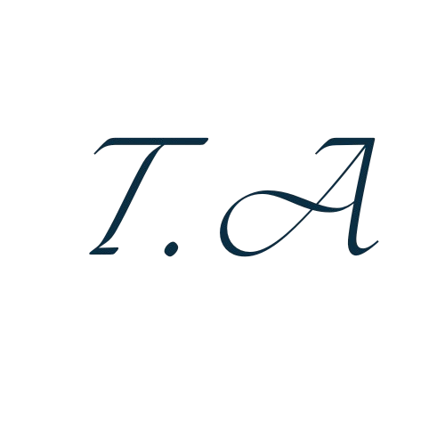

  
  <h1>YOLOv8 Object Detection & Crowd Monitoring System</h1>
  
<em>AI-powered object detection and crowd density analysis using YOLOv8, OpenCV, and Python.</em>

  

    
    
    
  

---

## 📖 Overview

This project is a **Python-based object detection and crowd monitoring tool** built using **YOLOv8** (Ultralytics).  
It allows real-time detection of multiple objects from a video or camera feed, focusing primarily on **people detection** and **crowd density estimation**.

When a potential **crowd gathering** is detected — i.e., when the average distance between detected individuals falls below a predefined threshold — the system:

- Connects detected bounding boxes with **red lines**,
- **Saves a snapshot** of the current frame,
- **Stores the data** in a database for later review,
- **Sends an alert message** to an operator’s phone.

The project includes a simple **Tkinter-based GUI**, **login system**, and **administrative dashboard** for reviewing historical records.

---

## 🧠 Core Features

- **YOLOv8 Object Detection**  
  Real-time detection of over 80 object classes using the `coco.names` file.

- **Person Tracking & Midpoint Calculation**  
  Draws bounding boxes and calculates the midpoint of each detected person.

- **Crowd Distance Analysis**  
  Computes average and relative distances between all detected people.  
  Flags potential crowd formations when predefined proximity limits are breached.

- **Automatic Snapshot Capture**  
  On crowd detection, saves a frame image automatically in a structured folder:

